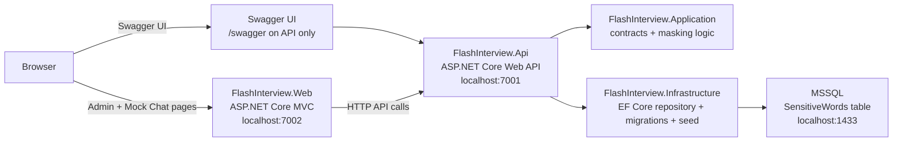
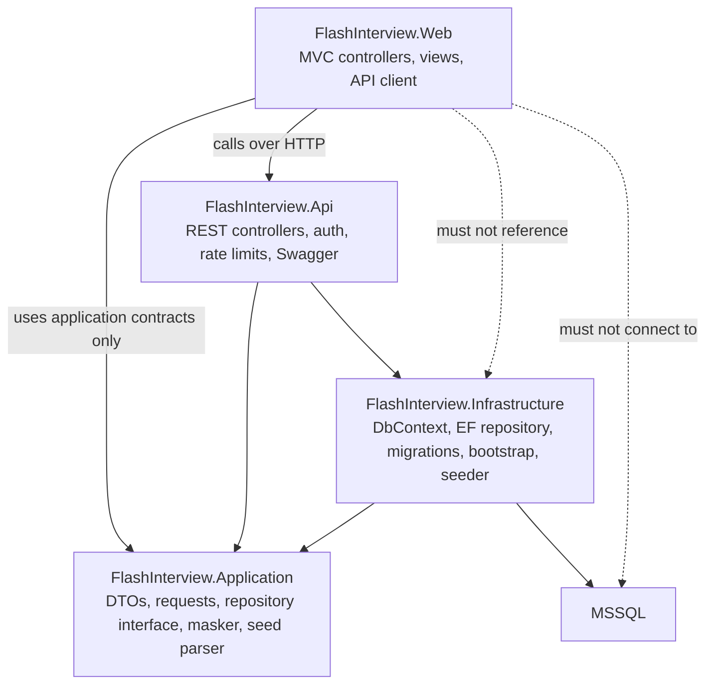
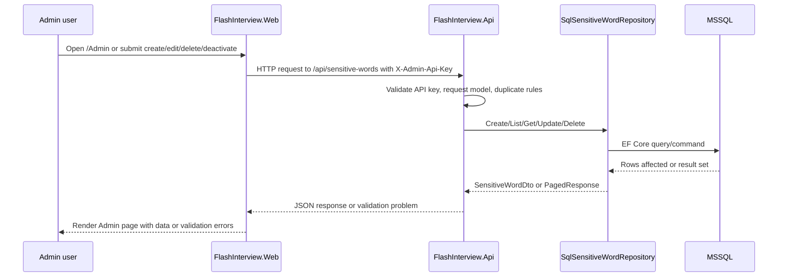
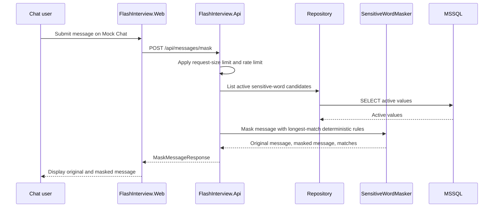
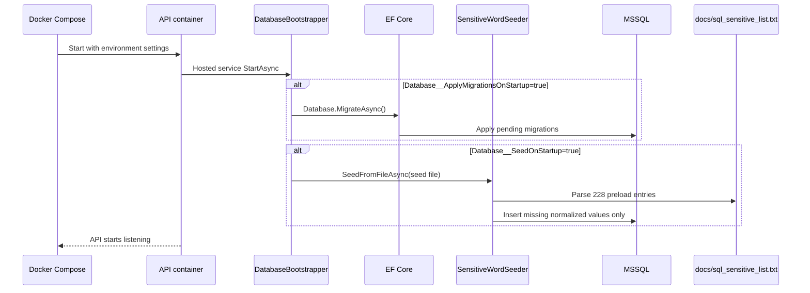
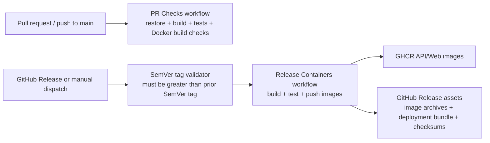

# Flash Interview

Sensitive Words interview project built with C# .NET Core, ASP.NET Core Web API, ASP.NET Core MVC, MSSQL, Swagger/OpenAPI, and Serilog.

The service stores configurable sensitive words in MSSQL and exposes:

- A REST API for internal sensitive-word CRUD protected by an admin API key.
- A rate-limited REST API endpoint for masking/blooping chat messages.
- A simple MVC Admin page that manages words through the API.
- A simple MVC mock Chat page that demonstrates masking through the API.

The MVC frontend must not connect directly to the database. Database access belongs to the API/infrastructure layer only.

## Architecture Guide

### Runtime Components



### Code Boundaries



### Admin Data Flow



### Mock Chat Data Flow



### Startup And Seed Flow



### CI And Release Flow



## Project Layout

```text
FlashInterview.slnx
.github/
  scripts/
    validate_semver_tag.py          Release tag validation used by CI
  workflows/
    pr-checks.yml                   PR/push restore, build, test, Docker build checks
    release-containers.yml          Release image publishing and asset upload
deploy/
  docker-compose.release.yml        Compose template using published image references
  release.env.example               Release environment variable template
docker-compose.dev.yml              Hot-reload local API, Web, and MSSQL stack
docker-compose.yml                  Production-shaped local Compose smoke test
src/
  FlashInterview.Application/       Shared contracts, interfaces, seed parsing, masking logic
    SensitiveWords/
      SensitiveWordMasker.cs        Deterministic longest-match masking behavior
      SensitiveWordSeedParser.cs    Parser for the supplied SQL-sensitive preload file
      *Request.cs / *Response.cs    API and MVC shared contracts
  FlashInterview.Infrastructure/    EF Core SQL Server persistence
    FlashInterviewDbContext.cs      DbContext and schema model
    Migrations/                     Initial MSSQL migration and model snapshot
    DatabaseBootstrapper.cs         Optional startup migrations and idempotent seed
    SensitiveWords/                 Entity, repository, and seed importer
  FlashInterview.Api/               REST API, Swagger, Serilog, auth, rate limits, health
    Controllers/                    Sensitive-word CRUD and message masking endpoints
    OpenApi/                        Swagger operation/document filters
    Security/                       Admin API-key authentication handler
  FlashInterview.Web/               ASP.NET Core MVC frontend using API HttpClient
    Clients/                        Typed API client with admin API-key header behavior
    Controllers/                    Admin and mock Chat MVC controllers
    Models/                         MVC view models
    Views/                          Razor views
tests/
  FlashInterview.Tests/             xUnit tests
    ApiSurfaceTests.cs              API auth, validation, rate limit, Swagger surface
    AdminWebTests.cs                MVC Admin client/controller/view behavior
    MssqlApiIntegrationTests.cs     Optional MSSQL-backed CRUD/migration/seed coverage
    SensitiveWord*Tests.cs          Masking, normalization, and seed parser tests
    WebProjectArchitectureTests.cs  Frontend database-boundary guard
docs/
  spec.md                           Product and delivery specification
  sql_sensitive_list.txt            SQL-sensitive preload list
```

## Requirements

- .NET SDK 10.0+
- Docker Desktop if using Compose
- MSSQL, provided by Compose for local development

## Local Development

Restore, build, and test:

```bash
dotnet restore FlashInterview.slnx
dotnet build FlashInterview.slnx --no-restore
dotnet test FlashInterview.slnx --no-build
```

The test suite includes MSSQL-backed integration tests for the API repository path, migrations, and the 228-entry preload. These tests create and drop isolated `FlashInterviewTests_<guid>` databases and are skipped automatically when SQL Server is not reachable on the default local development connection. To point them at a different SQL Server master database, set `FLASHINTERVIEW_TEST_MSSQL_MASTER`.

Run everything with hot reload:

```bash
docker compose -f docker-compose.dev.yml up --build
```

## Performance Lab

The performance lab is opt-in. It combines live observability with repeatable load reports:

- Aspire Dashboard receives OpenTelemetry metrics and traces from the API and MVC web app.
- API traces include ASP.NET request spans and EF Core database spans so database timing is visible.
- API metrics include request rates, request duration, runtime counters, HTTP client metrics, and masking-specific counters/histograms.
- BenchmarkDotNet measures the in-process masking engine without HTTP or SQL Server noise.
- NBomber drives HTTP load against the running API and writes throughput, latency, percentile, success-rate, and saturation reports.

Start the development stack with observability:

```bash
docker compose -f docker-compose.dev.yml -f docker-compose.observability.yml up --build
```

Open the dashboard:

- Aspire Dashboard: `http://localhost:18888`
- API: `http://localhost:7001`
- Web: `http://localhost:7002`

The observability Compose overlay binds dashboard ports to `127.0.0.1` and raises the mask rate limit for local performance-lab runs so capacity profiles measure API behavior rather than the default per-client throttle.

Run masking microbenchmarks:

```bash
dotnet run -c Release --project tests/FlashInterview.PerformanceTests -- benchmark
```

Run the API load smoke test:

```bash
dotnet run --project tests/FlashInterview.PerformanceTests -- load --base-url http://localhost:7001 --admin-api-key local-dev-admin-key --smoke
```

Run the baseline local load profile:

```bash
dotnet run --project tests/FlashInterview.PerformanceTests -- load --base-url http://localhost:7001 --admin-api-key local-dev-admin-key --profile baseline
```

Run the capacity ramp profile:

```bash
dotnet run --project tests/FlashInterview.PerformanceTests -- load --base-url http://localhost:7001 --admin-api-key local-dev-admin-key --profile capacity
```

Use NBomber reports for high-level throughput, request latency, percentiles, success rate, and saturation points. Use the Aspire Dashboard during the same run to inspect API request metrics, trace waterfalls, MVC-to-API calls, EF Core database spans, runtime counters, and masking-specific histograms.

Reports are written to `artifacts/performance/`. BenchmarkDotNet writes to `BenchmarkDotNet.Artifacts/`. Both folders are local artifacts and are not committed.

Development URLs:

- API: `http://localhost:7001`
- Swagger UI: `http://localhost:7001/swagger`
- MVC frontend: `http://localhost:7002`
- MSSQL: `localhost,1433`

The development API container runs `dotnet watch`, applies EF Core migrations on startup, and seeds `/workspace/docs/sql_sensitive_list.txt` when `Database__ApplyMigrationsOnStartup=true` and `Database__SeedOnStartup=true`.
The Compose file mounts project `bin/` and `obj/` directories to named Docker volumes so container restore/build metadata does not overwrite host-side .NET build metadata.
Development Compose sets a local-only admin API key for API/Web communication.

On Apple Silicon, the MSSQL container uses `platform: linux/amd64`, so Docker runs it through emulation.

## Production-Style Compose

Run the production-style containers:

```bash
docker compose up --build
```

For an evaluator-friendly local smoke test that builds images, starts MSSQL, applies migrations, seeds the supplied sensitive-word list, and waits for API readiness:

```bash
./scripts/run-local-smoke.sh
```

This command uses existing shell variables first, then values from `.env`, then local development defaults for `MSSQL_SA_PASSWORD` and `FLASHINTERVIEW_ADMIN_API_KEY`. It leaves the stack running on success so the API and MVC frontend can be inspected; stop it with `docker compose down`. On timeout or interruption, it prints recent API logs and stops the stack.

Production-style URLs:

- API: `http://localhost:8080`
- MVC frontend: `http://localhost:8081`

The production Compose file does not bind-mount source code and does not enable hot reload. It is intended as a deployment-shaped local smoke test, not a substitute for managed production infrastructure.
Automatic migrations and seed preload default to off in production-style Compose. For controlled deployment, run a one-off API container or release step with `Database__ApplyMigrationsOnStartup=true`; set `Database__SeedOnStartup=true` in the same controlled step only when the preload should be applied. The seed import is idempotent and runs after migrations.

Set `MSSQL_SA_PASSWORD` before running in any shared environment:

```bash
export MSSQL_SA_PASSWORD='replace-with-a-real-secret'
export FLASHINTERVIEW_ADMIN_API_KEY='replace-with-a-real-admin-key'
docker compose up --build
```

## Release Deployment Bundle

Published GitHub Releases include:

- GHCR images for the API and MVC frontend.
- Compressed Docker image archives as release assets for offline inspection or loading with `docker load`.
- A deployment bundle containing `docker-compose.yml`, `.env.example`, `.env.pinned`, image digests, and checksums.

To run a release bundle:

```bash
tar -xzf flash-interview-<tag>-deployment-bundle.tar.gz
cp .env.example .env
# edit .env and set MSSQL_SA_PASSWORD plus the published image tags or pinned digests
docker compose --env-file .env -f docker-compose.yml up -d
```

The checked-in release compose template is `deploy/docker-compose.release.yml`. It uses published image references and does not build from local source.

## CI/CD

GitHub Actions workflows live in `.github/workflows/`:

- `pr-checks.yml` runs on pull requests to `main` and pushes to `main`. It restores, builds, and tests the .NET solution, then verifies both production Dockerfiles build without publishing images.
- `release-containers.yml` runs when a GitHub Release is published or manually through `workflow_dispatch`. It restores/builds/tests, publishes API and Web images to GitHub Container Registry, creates compressed Docker image archives, and uploads release deployment assets.

Release tags must be Docker-compatible SemVer: `vMAJOR.MINOR.PATCH` or `MAJOR.MINOR.PATCH`, optionally with a prerelease suffix such as `v1.2.3-rc.1`. Build metadata such as `+build.1` is rejected because `+` is not valid in Docker image tags. The release workflow fails before publishing anything unless the release tag is greater than every previous SemVer tag in the repository.

Validate a tag locally:

```bash
python3 .github/scripts/validate_semver_tag.py v1.0.0
```

## Configuration

API configuration:

- `ConnectionStrings__DefaultConnection`: MSSQL connection string.
- `Database__ApplyMigrationsOnStartup`: set to `true` only for a controlled migration step.
- `Database__SeedOnStartup`: set to `true` to run the idempotent preload after the migration step.
- `Database__SeedFile`: path to the preload file.
- `Security__AdminApiKey`: required API key for internal sensitive-word CRUD. If missing, protected endpoints fail closed.
- `Security__MaskRateLimit__PermitLimit`: fixed-window permit count for `POST /api/messages/mask`, default `60`.
- `Security__MaskRateLimit__WindowSeconds`: fixed-window length in seconds for `POST /api/messages/mask`, default `60`.

MVC configuration:

- `SensitiveWordsApi__BaseUrl`: base URL for the REST API.
- `SensitiveWordsApi__AdminApiKey`: API key sent only on MVC Admin CRUD/list requests. Production deployments must supply this through environment variables or secrets management; the checked-in production appsettings value is only a placeholder.

## Logging

Serilog is configured in both web applications:

- `FlashInterview.Api`
- `FlashInterview.Web`

Both write structured logs to console and use Serilog request logging for HTTP requests. Container platforms can collect logs directly from stdout/stderr.

Request log events include the application identity, HTTP method, path, status code, and elapsed time. Development and container-development settings keep framework, EF Core SQL command, and outbound HttpClient logs at `Warning` to avoid drowning out useful request and application events.

Unexpected exceptions are handled globally in both web entrypoints. The exception is logged server-side with request method/path context, while API clients receive a generic problem response and MVC users receive a generic error page without stack traces. Do not add request-body logging for `POST /api/messages/mask` or MVC chat submissions; raw chat message bodies are intentionally excluded from logs.

## API Surface

Sensitive-word CRUD:

- `POST /api/sensitive-words`
- `GET /api/sensitive-words`
- `GET /api/sensitive-words/{id}`
- `PUT /api/sensitive-words/{id}`
- `DELETE /api/sensitive-words/{id}`

These internal endpoints require the `X-Admin-Api-Key` header.

Masking endpoint:

- `POST /api/messages/mask`

The masking endpoint does not require the admin API key. It is rate limited and rejects oversized request bodies before normal message validation.

Health endpoints:

- `GET /healthz`: process liveness only; it does not require MSSQL.
- `GET /readyz`: readiness check that verifies the API can reach MSSQL.

Swagger UI is enabled in development on the API app at `http://localhost:7001/swagger`. The MVC frontend on `http://localhost:7002` does not host Swagger.
Swagger UI and JSON endpoints are intentionally enabled only for Development in this submission. The OpenAPI generation is covered by tests; exposing Swagger in production would require an explicit code/configuration change and should be placed behind authenticated internal access if the hosting environment requires live API documentation.

## Test Coverage

The current xUnit suite covers:

- Sensitive-word normalization, seed parsing, and deterministic masking edge cases.
- REST API surface behavior, admin API-key protection, and mask rate limiting using `WebApplicationFactory` with a fake repository, so endpoint checks do not require MSSQL.
- Optional MSSQL-backed API and preload integration coverage using isolated test databases when local SQL Server is available.
- CI starts a SQL Server service container so MSSQL-backed CRUD, migration, and seed tests run in pull-request checks instead of being silently skipped.
- MVC project architecture guards that prevent direct EF Core, SQL Server, or infrastructure references in the frontend.
- MVC API-client behavior, including sending the admin API key only for Admin requests.

## Current Codebase Status

The scaffold is compile-ready and includes core deterministic masking behavior, REST API surface tests, admin API-key protection for internal CRUD, rate limiting for the mask endpoint, completed basic Admin management workflows, frontend database-boundary checks, and an initial EF Core migration for the MSSQL schema. Database bootstrap uses controlled `MigrateAsync` startup behavior when explicitly enabled; production-style Compose leaves it disabled by default. The mask endpoint uses a cached compiled matcher that is invalidated after sensitive-word writes, so normal chat requests do not rebuild the active word list on every call.
